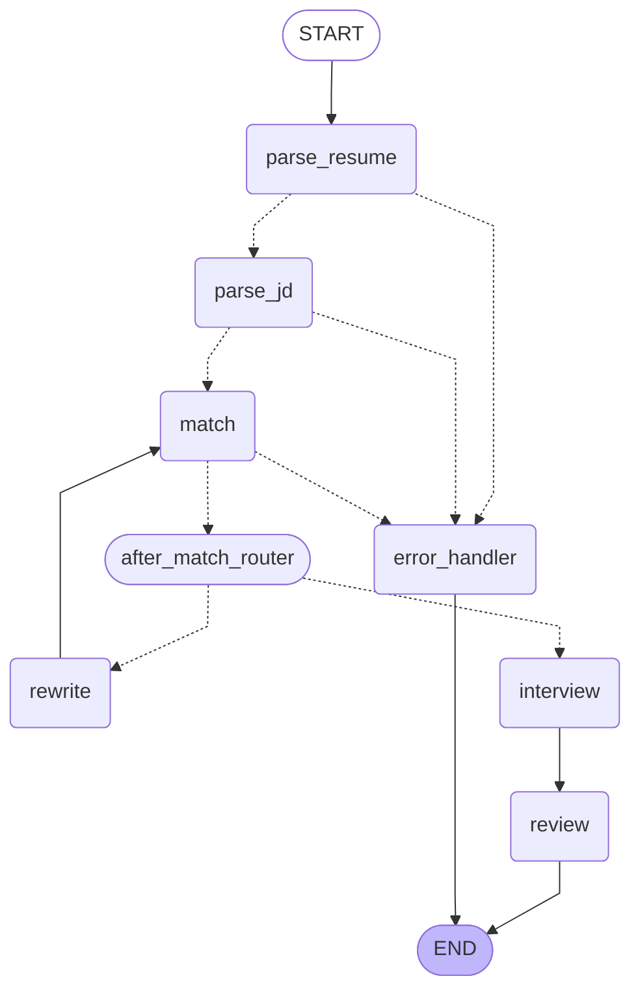

# Workflow Architecture — LangGraph State Machine

**File:** `agent-service/app/graph/workflow.py`  
**State:** `agent-service/app/graph/state.py`  
**LangGraph version:** 1.2.5  
**Checkpointer:** `MemorySaver` (in-process; swap for `PostgresSaver` in production)

---

## Graph Diagram



Solid arrows (`-->`) are unconditional edges.  
Dashed arrows (`-.->`) are conditional edges (routing functions decide at runtime).

---

## Nodes

### `parse_resume`

**Function:** `parse_resume_node(state)`  
**Phase:** Real agent (Phase 1)

Reads `state["resume_file_path"]` and calls `ResumeAgent().parse(file_path)`.  
On success, writes:

| State field | Value |
|---|---|
| `resume` | `ParsedResume.model_dump()` |
| `resume_raw_text` | `ParsedResume.raw_text` (full untruncated text) |
| `current_step` | `"parsing_resume"` |
| `agent_runs` | appended with `ResumeAgent` run log |
| `error` | `None` |

On failure, writes `current_step="error"`, `error=<message>`, and a failed `agent_run` entry.

---

### `parse_jd`

**Function:** `parse_jd_node(state)`  
**Phase:** Real agent (Phase 1)

Reads `state["jd_text"]` and calls `JDAgent().parse(jd_text)`.  
Supports raw text or a URL (routed internally by `JDAgent`).  
On success, writes `jd`, `current_step="parsing_jd"`, `agent_run`.

---

### `match`

**Function:** `match_node(state)`  
**Phase:** Real agent (Phase 2)

Reconstructs `ParsedResume` and `ParsedJobDescription` from state dicts via
`model_validate()`, then calls `MatchAgent().match(resume, jd)`.  
On success, writes:

| State field | Value |
|---|---|
| `match_result` | `MatchResult.model_dump()` with `overall_score`, `skill_score`, `experience_score`, `keyword_score`, gap analysis |
| `current_step` | `"matching"` |
| `agent_runs` | appended with `MatchAgent` run log |

This node is visited **twice** if `rewrite` runs first (the rewrite loop feeds back here).

---

### `rewrite`

**Function:** `rewrite_node(state)`  
**Phase:** Placeholder — RewriteAgent wired in Phase 4

Called when `overall_score < 70`.  Improves the resume to better fit the JD.  
After rewriting, routes back to `match` for re-scoring.  
Appends an entry to `state["rewrite_history"]`.

---

### `interview`

**Function:** `interview_node(state)`  
**Phase:** Placeholder — InterviewAgent wired in Phase 5

Called when `overall_score >= 70`.  Runs a multi-turn mock interview using
RAG-retrieved questions from Qdrant.  Appends turns to `state["interview_messages"]`.

---

### `review`

**Function:** `review_node(state)`  
**Phase:** Placeholder — CoachAgent wired in Phase 5

Runs after the interview ends.  Analyses the full conversation and writes
a structured evaluation to `state["interview_review"]`.

---

### `error_handler`

**Function:** `error_handler_node(state)`  
**Phase:** Always active

Terminal error node.  Logs `state["error"]`, sets `current_step="error"`,
then transitions to `END`.  Every real-agent node routes here on failure,
so the workflow always terminates cleanly rather than propagating exceptions.

---

### `__after_match__` (internal passthrough)

An invisible no-op node (`lambda s: {}`) used as a named intermediate point
so that the two-stage routing after `match` can compose:

1. `_check_error("__after_match__")` — diverts to `error_handler` on failure, else passes through.
2. `after_match_router` — reads `overall_score` and routes to `rewrite` or `interview`.

LangGraph conditional edges can only target named nodes, not other routers,
so this passthrough bridges the two routing steps.

---

## Routing Functions

### `_check_error(next_node)` — factory

Returns a closure that routes to `"error_handler"` when `state["error"]` is
set, otherwise to `next_node`.  Applied after every real-agent node:

| Source node | On error | On success |
|---|---|---|
| `parse_resume` | `error_handler` | `parse_jd` |
| `parse_jd` | `error_handler` | `match` |
| `match` | `error_handler` | `__after_match__` |

### `after_match_router`

Reads `state["match_result"]["overall_score"]`:

| Score | Route |
|---|---|
| `< 70` | `rewrite` |
| `>= 70` | `interview` |
| `current_step == "error"` | `END` (defensive guard for direct test calls) |

---

## Error Handling Flow

```
parse_resume_node
  ├─ missing file path  ─┐
  └─ exception caught   ─┤
                          ↓
                    error field set in state
                    failed agent_run logged
                          ↓
              _check_error("parse_jd") detects error
                          ↓
                   error_handler_node
                    logs state["error"]
                    sets current_step="error"
                          ↓
                          END
```

The same pattern repeats after `parse_jd` and `match`.

Key properties:
- **No exceptions propagate** out of node functions — all are caught internally.
- **Every failure is logged** as a `status="error"` entry in `state["agent_runs"]`.
- **State is always valid** when the graph exits, whether success or failure.
- **Checkpoint is written** even on error paths, so the failure state is inspectable via `get_workflow_state(thread_id)`.

---

## State Schema

Defined in `app/graph/state.py` as `JobHelperState(TypedDict)`.

| Field | Type | Set by | Purpose |
|---|---|---|---|
| `user_id` | `str` | Caller | Scopes DB writes; used as default `thread_id` |
| `resume_file_path` | `Optional[str]` | Caller | Input to `parse_resume` node |
| `jd_text` | `Optional[str]` | Caller | Input to `parse_jd` node |
| `resume` | `Optional[dict]` | `parse_resume` | `ParsedResume.model_dump()` |
| `resume_raw_text` | `Optional[str]` | `parse_resume` | Full extracted text for fidelity checking |
| `jd` | `Optional[dict]` | `parse_jd` | `ParsedJobDescription.model_dump()` |
| `match_result` | `Optional[dict]` | `match` | `MatchResult.model_dump()` with all scores |
| `rewrite_history` | `list[dict]` | `rewrite` | One entry per rewriting attempt |
| `interview_messages` | `list[dict]` | `interview` | Running conversation log |
| `interview_review` | `Optional[dict]` | `review` | Structured coach evaluation |
| `current_step` | `str` | Every node | Progress label for frontend SSE |
| `error` | `Optional[str]` | Error paths | Last error message; `None` on success |
| `agent_runs` | `list[dict]` | Every agent node | Accumulated `log_agent_run()` dicts |

---

## Checkpointing

The graph is compiled with `checkpointer=MemorySaver()`.  Every node transition
is persisted under a `thread_id`.

```python
# Invoke a workflow — thread_id defaults to user_id
final_state = run_workflow(
    user_id="user-42",
    resume_file_path="/tmp/jane_doe.pdf",
    jd_text="We are hiring a backend engineer...",
    thread_id="user-42-run-001",   # optional explicit ID
)

# Inspect the checkpoint at any time (even mid-run from another process)
snap = get_workflow_state("user-42-run-001")
print(snap["values"]["current_step"])  # e.g. "matching"
print(snap["next"])                    # [] = complete, [...] = in progress
```

In production, replace `MemorySaver` with `PostgresSaver` pointing at the
same PostgreSQL instance used by the Spring Boot backend so checkpoints
survive restarts and can be read cross-process.

---

## Invocation from Spring Boot

`WorkflowController.java` → `AgentServiceClient.runWorkflow()` → `POST /api/workflow/run`

The Spring Boot layer:
1. Loads `Resume` and `JobDescription` entities from the database.
2. Passes `resume.filePath` and `jd.rawText` to the agent-service.
3. Receives the final `JobHelperState` JSON.
4. Iterates `state["agent_runs"]` and persists each entry via `AgentRunService.saveFromResponse()`.
5. Returns the full state to the frontend.

The workflow status endpoint (`GET /api/workflow/status/{threadId}`) can be
polled to show real-time progress in the frontend before the workflow completes.
